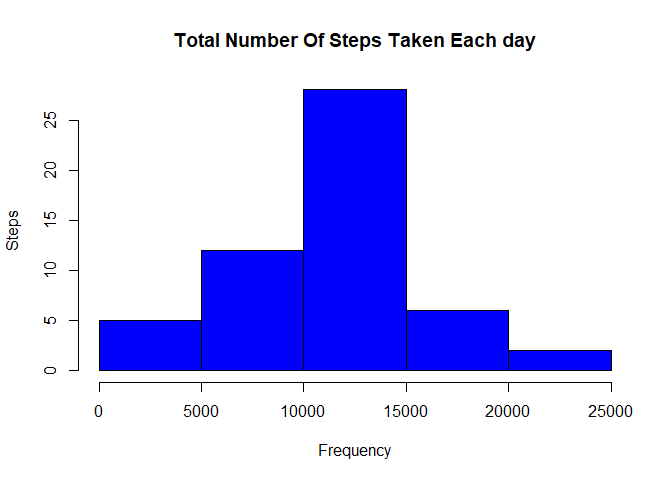
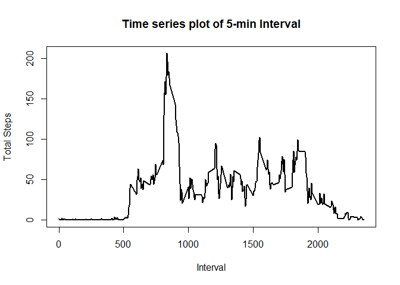
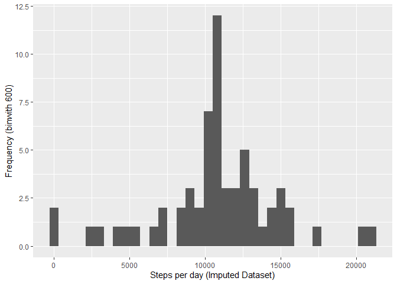
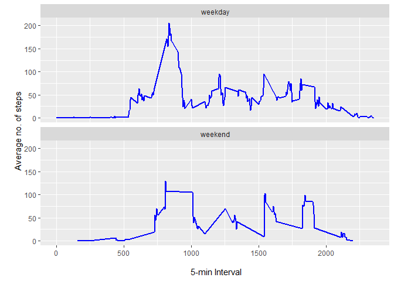

## Loading and preprocessing the data

```r
activityData <- read.csv('activity.csv', header = TRUE)
```

## What is mean total number of steps taken per day?
### Calculate total no. of steps taken per day

```r
steps <- aggregate(steps ~ date, data = activityData, FUN = sum, na.rm = TRUE)
head(steps)
```

```
##         date steps
## 1 2012-10-02   126
## 2 2012-10-03 11352
## 3 2012-10-04 12116
## 4 2012-10-05 13294
## 5 2012-10-06 15420
## 6 2012-10-07 11015
```
### Histogram


```r
hist(steps$steps, 
     col="blue", 
     xlab = "Frequency", 
     ylab = "Steps",
     main = "Total Number Of Steps Taken Each day")
```

<!-- -->

### Mean and median of total steps taken each day


```r
stepsMean <- mean(steps$steps)
stepsMedian <- median(steps$steps)

#Mean
stepsMean
```

```
## [1] 10766.19
```

```r
#Median
stepsMedian
```

```
## [1] 10765
```

## What is the average daily activity pattern?
### Time series plot 

```r
aggInterval <- aggregate(steps ~ interval, data = activityData, FUN = mean, na.rm = TRUE)

plot(aggInterval$interval, aggInterval$steps, 
     type = "l", lwd = 2,
     xlab = "Interval", 
     ylab = "Total Steps",
     main = "Time series plot of 5-min Interval")
```

<!-- -->
### Which 5-minute interval, on average across all the days in the dataset, contains the maximum number of steps?


```r
max5MinSteps <- aggInterval$interval[which.max(aggInterval$steps)]
max5MinSteps
```

```
## [1] 835
```


## Imputing missing values
### Calculate and report the total number of missing values in the dataset (i.e. the total number of rows with \color{red}{\verb|NA|}NAs)


```r
naValues <- length(which(is.na(activityData$steps)))
naValues
```

```
## [1] 2304
```

### Devise a strategy for filling in all of the missing values in the dataset. The strategy does not need to be sophisticated. For example, you could use the mean/median for that day, or the mean for that 5-minute interval, etc.


```r
#Mean steps over 5-minute interval
meanInterval<- aggregate(steps ~ interval, activityData, FUN=mean)

#Merging the the original data set with mean of total steps for a date
mergedData <- merge(x=activityData, y=meanInterval, by="interval")

#Replacing the NA values with the mean
mergedData$steps <- ifelse(is.na(mergedData$steps.x), mergedData$steps.y, mergedData$steps.x)

head(mergedData)
```

```
##   interval steps.x       date  steps.y    steps
## 1        0      NA 2012-10-01 1.716981 1.716981
## 2        0       0 2012-11-23 1.716981 0.000000
## 3        0       0 2012-10-28 1.716981 0.000000
## 4        0       0 2012-11-06 1.716981 0.000000
## 5        0       0 2012-11-24 1.716981 0.000000
## 6        0       0 2012-11-15 1.716981 0.000000
```

### Create a new dataset that is equal to the original dataset but with the missing data filled in.


```r
imputedData <- activityData
imputedData$steps <- impute(activityData$steps, fun=mean)
```

### Make a histogram of the total number of steps taken each day and Calculate and report the mean and median total number of steps taken per day. Do these values differ from the estimates from the first part of the assignment? What is the impact of imputing missing data on the estimates of the total daily number of steps?


```r
# Aggregating(summation) of steps over date
#newImputedData <- aggregate(steps ~ date, imputedData, FUN=sum)

stepsPerDayImputed <- tapply(imputedData$steps, imputedData$date, sum)
qplot(stepsPerDayImputed, xlab='Steps per day (Imputed Dataset)', ylab='Frequency (binwith 600)', binwidth=600)
```

<!-- -->

```r
stepsPerDayMeanImputed <- mean(stepsPerDayImputed)
#### Mean
stepsPerDayMeanImputed
```

```
## [1] 10766.19
```

```r
stepsPerDayMedianImputed <- median(stepsPerDayImputed)
#### Median
stepsPerDayMedianImputed
```

```
## [1] 10766.19
```

## Are there differences in activity patterns between weekdays and weekends?

#### Create a new factor variable in the dataset with two levels – “weekday” and “weekend” indicating whether a given date is a weekday or weekend day.


```r
#table(is.weekend(mergedData$date))
mergedData$dayofweek <- ifelse(is.weekend(imputedData$date), "weekend", "weekday")
#table
head(mergedData)
```

```
##   interval steps.x       date  steps.y    steps dayofweek
## 1        0      NA 2012-10-01 1.716981 1.716981   weekday
## 2        0       0 2012-11-23 1.716981 0.000000   weekday
## 3        0       0 2012-10-28 1.716981 0.000000   weekday
## 4        0       0 2012-11-06 1.716981 0.000000   weekday
## 5        0       0 2012-11-24 1.716981 0.000000   weekday
## 6        0       0 2012-11-15 1.716981 0.000000   weekday
```

### Make a panel plot containing a time series plot (i.e. \color{red}{\verb|type = "l"|}type = "l") of the 5-minute interval (x-axis) and the average number of steps taken, averaged across all weekday days or weekend days (y-axis). See the README file in the GitHub repository to see an example of what this plot should look like using simulated data.


```r
meanIntervalImputedData <- aggregate(steps ~ interval + dayofweek, mergedData, FUN=mean)
ggplot(meanIntervalImputedData, aes(x=interval, y=steps)) + 
  geom_line(color="blue", size=1) + 
  facet_wrap(~dayofweek, nrow=2) +
  labs(x="\n 5-min Interval", y="\n Average no. of steps")
```

<!-- -->
